# OMEGA SYSTEM MAP — v1.0

**Réponse produite sous contrainte OMEGA — NASA-grade — aucune approximation tolérée.**

```
╔═══════════════════════════════════════════════════════════════════════════════════════╗
║                                                                                       ║
║   OMEGA SYSTEM MAP — DUAL TOPOLOGY                                                    ║
║   Structural (what exists) + Decisional (how truth flows)                              ║
║                                                                                       ║
║   HEAD:     76434668                                                                  ║
║   Status:   BUILD SEALED — GOVERNANCE SEALED                                          ║
║   Source:   Repository scan (not approximation)                                       ║
║                                                                                       ║
╚═══════════════════════════════════════════════════════════════════════════════════════╝
```

---

## MAP A — STRUCTURAL TOPOLOGY

*What exists. Where it lives. How layers stack.*


---

## MAP B — DECISIONAL TOPOLOGY

*How truth flows. From raw input to certified output to monitored execution.*


---

## MAP C — GOVERNANCE DETAIL

*The 7-module governance shell. All read-only. All observable.*


---

## MAP D — MODULE INVENTORY (28 packages)

| Package | Layer | Role | Key Export |
|---------|-------|------|-----------|
| `canon-kernel` | L2 | Core canon persistence | CanonStore |
| `contracts-canon` | L2 | Canon interface contracts | CanonContract |
| `decision-engine` | L3 | Decision pipeline | DecisionEngine |
| `emotion-gate` | L1 | Emotion processing gate | EmotionGate |
| `genome` | L1 | Narrative genome extraction | GenomeExtractor |
| `gold-cli` | Infra | CLI tooling | — |
| `gold-internal` | Infra | Internal utilities | — |
| `gold-master` | Infra | Gold master baseline | GoldMaster |
| `gold-suite` | Infra | Test suite framework | GoldSuite |
| `hardening` | Infra | Security hardening | — |
| `headless-runner` | Infra | Headless execution | HeadlessRunner |
| `hostile` | Infra | Adversarial testing | HostileRunner |
| `integration-nexus-dep` | Infra | Nexus integration | — |
| `mod-narrative` | L4 | Narrative modifiers | NarrativeMod |
| `mycelium` | L1 | Emotional DNA fingerprint | Mycelium |
| `mycelium-bio` | L1 | Biological DNA model | BioModel |
| `omega-aggregate-dna` | L1 | DNA aggregation | AggregateEngine |
| `omega-bridge-ta-mycelium` | L1 | Analyzer↔Mycelium bridge | Bridge |
| `omega-observability` | L5 | Metrics + tracing | Observer |
| `omega-segment-engine` | L1 | Text segmentation | Segmenter |
| `oracle` | L1 | Oracle framework | OracleEngine |
| `orchestrator-core` | L4 | Flow orchestration | Orchestrator |
| `performance` | Infra | Performance benchmarks | PerfRunner |
| `proof-pack` | Infra | Proof bundle generation | ProofPacker |
| `sbom` | Infra | Software bill of materials | SBOMGenerator |
| `schemas` | L0 | JSON Schema definitions | SchemaRegistry |
| `search` | L1 | Search capabilities | SearchEngine |
| `sentinel-judge` | L3 | Judgment pipeline | SentinelJudge |
| `trust-version` | L5 | Version trust chain | TrustVersion |
| `truth-gate` | L3 | Pass/fail validation | TruthGate |

---

## MAP E — CRITICAL BOUNDARIES

```mermaid
graph LR
    subgraph FORBIDDEN["🚫 FORBIDDEN CROSSINGS"]
        F1["GOVERNANCE → modifies → BUILD<br/>❌ NEVER"]
        F2["BUILD → calls → GOVERNANCE<br/>❌ NEVER"]
        F3["Any layer → skips → Truth Gate<br/>❌ NEVER"]
        F4["Anyone → modifies → sealed phase<br/>❌ NEVER"]
    end

    subgraph ALLOWED["✅ PERMITTED FLOWS"]
        A1["GOVERNANCE → reads → BUILD outputs<br/>✅ ALWAYS"]
        A2["BUILD L(n) → uses → BUILD L(n-1)<br/>✅ LAYERED"]
        A3["GOVERNANCE → alerts → Human<br/>✅ ADVISORY"]
        A4["Human → overrides → via GOVERNANCE<br/>✅ TRACED + BOUNDED"]
    end

    classDef forbidden fill:#b71c1c,stroke:#f44336,color:#fff
    classDef allowed fill:#1b5e20,stroke:#4caf50,color:#fff

    class FORBIDDEN forbidden
    class ALLOWED allowed
```



---

## INVARIANTS

```
INV-SM-01: Maps are generated from repository scan, not invention
INV-SM-02: Structural map reflects actual directory layout
INV-SM-03: Decisional map reflects actual code flow
INV-SM-04: No module exists in map that doesn't exist in repo
INV-SM-05: Boundary rules are enforced by architecture, not convention
```

---

**FIN DU DOCUMENT OMEGA_SYSTEM_MAP v1.0**

*HEAD: 76434668 | Topologies: 5 maps | Packages: 28 | Layers: 6 | Governance modules: 7*
